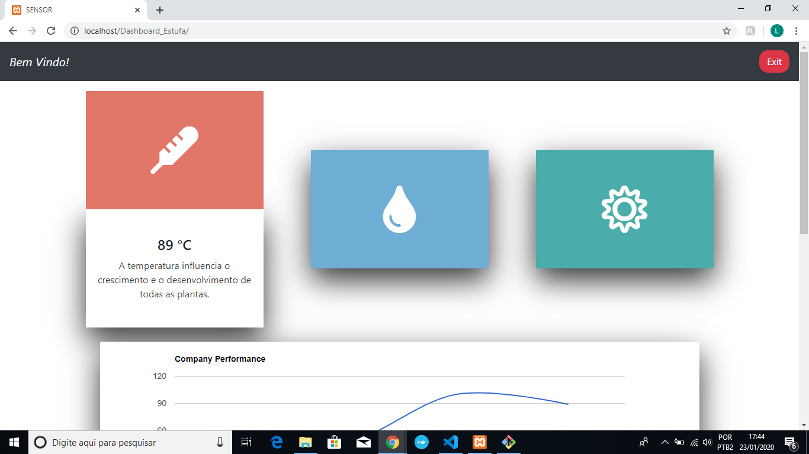
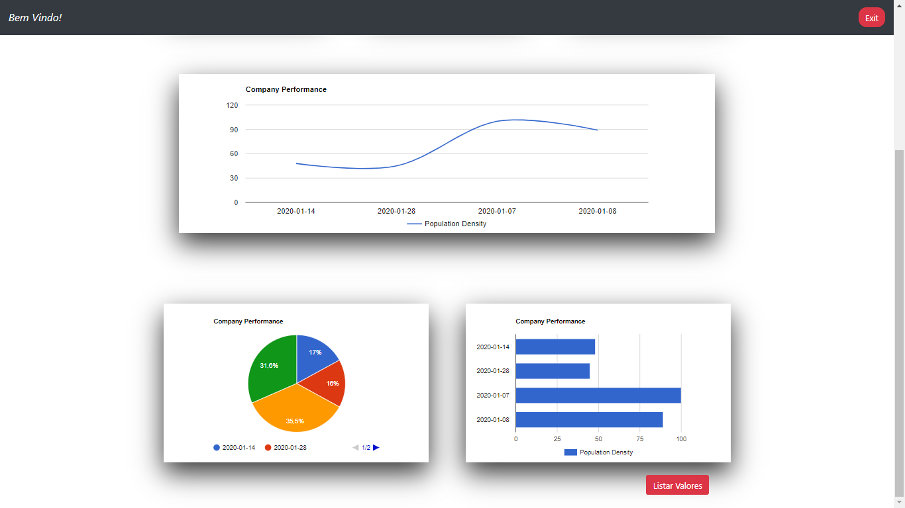

# Sistema de Automatização de Estufa para Germinação de Sementes e Qualidade de Frutos.

>Aprovado no Edital Edital n° 12/2018 Programa Institucional de Bolsas de Iniciação em Desenvolvimento Tecnológico e 
Inovação – PIBITI/CNPq

### Objetivo
>O objetivo geral do projeto é desenvolver uma estufa automatizada de baixo custo voltada para o pequeno produtor de frutas locais, visando melhorar as condições de germinação de sementes e qualidade das frutas, e agregar valor à produção.

> Dentro dos Objetivos Especificos foi colocado um ambiente WEB para que o usuario possa monitarar de sua casa. 

## Disciplina de Desenvolvimento WEB
> O objetivo final da disciplina é desenvolver um ambiente WEB. Como neste projeto especificamente o seu ambiente web já estava desenvolvido (Imagem 1), a proposta sugerida pelo Professor Luis Carlos seria modificar um ambiente para se tornar mais amigavel ao usuario. Resolvemos modificar o *ambiente 2*, que seria apos o longin do usuario.


## Tecnologias usadas para a construção do Circuito
#### Lista de Materias.
* NodeMCU
* DTH11
* LDR
* FC 28
* LEDs RGB
* Arduino


>Para o trabalho da disciplina foi realizado apenas um teste inicial com um potenciometro, apos só ocorreu a variação dos dados pelo nosso banco de dados. Como o circuito não é soldado é possivel de falha, podendo atrapalhar a construção do ambiente. Então foi decidido usar essa abordagem. 


#### Circuito 


> Para fins de estudos futuros, foi feito um codigo simples e que irá servir como base para qualquer aplicação com ou mais sensores usando *esp e um ambiente web*.

## Código na IDE do Arduino 

```
#include <WiFi.h>

const char* ssid = "";//Rede a qual o modulo estará conectado
const char* password = "";//Senha da Rede
const char* host = "192.168.0.100";//endereço do server

int erro = 22;
int succ = 23;
int poten = 0;

void setup() {

  pinMode(erro, OUTPUT);
  pinMode(succ, OUTPUT);
  
  Serial.begin(115200);
  delay(10);
  
  // Connectar a rede wifi
  Serial.println();
  Serial.println();
  Serial.print("Connectando a ");
  Serial.println(ssid);
  
  WiFi.begin(ssid, password);

  while (WiFi.status() != WL_CONNECTED) {
    delay(500);
    Serial.print(".");
  }
  
  Serial.println();
  Serial.println("WiFi conectado");
  Serial.println("Endereço IP: ");
  Serial.println(WiFi.localIP());
}

void loop() {
  //===================================
  //  espaço para leitura de sensores;
  poten = analogRead(34);
  //===================================
  Serial.println("Conectando a ");
  Serial.println(host);

  WiFiClient client;
  const int httpPort = 80;
  if (!client.connect(host,httpPort)){
    Serial.println("Falha na conexão");
    return;
  }
// criando URI para requisição
  String url = "/sensor/salvar.php?";
         url += "value=";
         url += poten;
         
  Serial.print("Requisitando URL: ");
  Serial.println(url);
  
  client.print(String("GET ") + url + " HTTP/1.1\r\n" + 
                "Host: " + host + "\r\n" +
                "Connection: close\r\n\r\n");
                
//verifica o tempo da solicitação

  unsigned long timeout = millis();
  while (client.available() == 0) {
    if (millis() - timeout > 5000){
      Serial.println(">>> Client Timeout !");
      client.stop();
      return;
    }
  }

  // captura o retorno do server e imprime na serial
  while(client.available()){
    String line = client.readStringUntil('\r');

  
    if(line.indexOf("Dados_Salvos_Com_Sucesso") != -1){
      Serial.println();
      Serial.println("Salvo com Sucesso");
      digitalWrite(succ, HIGH);
    }else if(line.indexOf("ERRO: Dados_Não_Foram_Salvos") != -1){
      Serial.println();
      Serial.println("Falha ao salvar dados");
      digitalWrite(erro, HIGH);
    }
  }
  
  Serial.println();
  Serial.println("Conexão Fechada");
  
  delay(10000);  
  digitalWrite(erro, LOW);
  digitalWrite(succ, LOW);
}

```

## Ambiente WEB - Dashboard Hilaris

> Como Citado anteriormente o ambiente foi pensado para ser mais intuitivo e agradavel para o usuario. Então a proposta foi colocar cards, tais cards conteriam o ultimo valor lido pelo sensor e teriam icones que representassem cada sensor.

>Para a construção dos Cards, foi utilizado CSS e HTML.


> Para a criação do grafico fizemos uso de uma ferramena do Google, o 	[Google Charts](https://developers.google.com/chart/interactive/docs), ela já nos gera graficos com os dados que escolhemos. Vale salientar a facilidade para criar um grafico nela é enorme, em sua própria pagina tem um tutorial ensinando a usar.

>Entretanto como queriamos gerar nossos graficos de acordo com os dados do nosso json, tivemos que fazer uso de outro [tutorial](http://webzoon.blogspot.com/2015/04/como-criar-graficos-com-api-do-google.html), tal foi de grande ajuda para finalizar o projeto.



#### Tecnologias Utilizadas para a criação.
* VisualStudio Code 
* GitHub
* XAMPP
* Bootstrap

## Conclusão
> A experiencia de realizar esse projeto trouxe só feedback positivos, pude conhecer novas tecnologias. Me deparar com desafios, tais como o do grafico, e conseguir superar.Sem contar que o resultado final foi como esperado, toda a interface funcionando.


